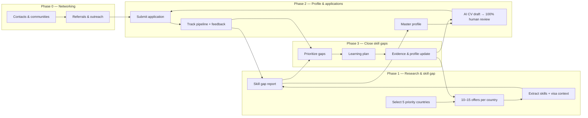

# jobHunter — Emad Poursina

Personal workflow for finding, qualifying, and applying to **backend / full-stack JavaScript** roles with **migration via job offer** (employer visa sponsorship required).

## Target role

- **Primary:** Backend / Node.js engineer (NestJS path)
- **Secondary:** Full-stack JavaScript (React, Next.js, TypeScript)
- **Experience band:** 7+ years, mid–senior
- **Migration path:** Employer visa sponsorship (Iranian passport)
- **Upskilling:** One flagship project — see [`skills/skill-map.md`](skills/skill-map.md) and [`learning/flagship-project.md`](learning/flagship-project.md)

---

## Project architecture overview

Four phases form a loop. **Phase 2 and Phase 3 run in parallel** — do not wait until all skill gaps are closed before applying.



### Phase 0 — Networking & referrals

**Goal:** Access hidden market and warm introductions alongside cold applications.

| Step | Description |
|------|-------------|
| 0.1 | Map diaspora communities, local tech meetups (virtual), and LinkedIn contacts in priority countries. |
| 0.2 | Track outreach and referrals; note who referred which company or role. |
| 0.3 | Prefer referred or warm paths when available; still run Phase 2 for direct applications in parallel. |

**Outputs:** Contact list, outreach log, referral links to applications.

**Folder:** [`networking/`](networking/)

---

### Phase 1 — Research & skill gap analysis

**Goal:** Understand demand, visa feasibility, and skill expectations before scaling applications.

| Step | Description |
|------|-------------|
| 1.1 | Choose **five priority countries**; apply elsewhere too, but weight effort toward these five. |
| 1.2 | Per priority country, collect **10–15 representative job offers** for backend / full-stack roles (same seniority band, posted within ~90 days, credible sources). |
| 1.3 | For each country, record **immigration context**: typical work-permit route via job offer, language threshold, sponsorship likelihood. |
| 1.4 | Extract skills, experience, certifications, and language requirements from the corpus. |
| 1.5 | Compare against your profile → **skill gap report** (missing, weak, strong). |

**Representative offer rules**

- Title family: Backend Engineer, Software Engineer (backend-leaning), Full-Stack Developer
- Consistent seniority (e.g. mid or senior — pick one band per sampling round)
- Sources: company careers pages, LinkedIn, national job boards — not aggregator spam

**Outputs:** Priority country files, job-offer corpus, skill gap report.

**Folders:** [`countries/`](countries/), [`job-offers/`](job-offers/), [`skills/`](skills/)

**Agent:** [`docs/agents/job-offer-research.md`](docs/agents/job-offer-research.md) — collects 10–15 verified offers per country into `job-offers/by-country/<code>/research.md`.

---

### Phase 2 — Profile, tailored applications & pipeline

**Goal:** One consistent identity; every application customized and reviewed.

| Step | Description |
|------|-------------|
| 2.1 | Maintain a **master profile** — single source of truth for experience, projects, education, skills, languages, authorization notes. |
| 2.2 | For each offer: AI generates a **job-specific CV** (optional cover letter) from master profile + offer text. |
| 2.3 | **100% human review** before every send — no unreviewed AI output. |
| 2.4 | Submit and **track pipeline**: sent → response → screening → interview → offer / rejection. |
| 2.5 | Log **recruiter and interview feedback**; feed recurring themes back into Phase 1 sampling and Phase 3 priorities. |

**Outputs:** Master profile, reviewed CVs, application log, feedback notes.

**Folders:** [`profile/`](profile/), [`documents/`](documents/), [`applications/`](applications/)

**Agent:** [`docs/agents/cv-generator.md`](docs/agents/cv-generator.md) — reads master profile + offer file → `documents/generated/CV_<Company>_<Role>_<Date>.md`

---

### Phase 3 — Close skill gaps (parallel with Phase 2)

**Goal:** Reduce gaps from Phase 1 and real signals from Phase 2 while applications continue.

| Step | Description |
|------|-------------|
| 3.1 | Merge Phase 1 gap report with Phase 2 feedback (rejections, interview notes, new listings). |
| 3.2 | Prioritize by frequency in target jobs, effort, and visa / search deadlines. |
| 3.3 | Execute learning plan — courses, certs, portfolio projects, open source, language study. |
| 3.4 | Add evidence to master profile; re-sample offers periodically to confirm gaps are closing. |

**Outputs:** Learning backlog, completed items, updated profile, revised gap report.

**Folder:** [`learning/`](learning/)

---

### Cross-cutting: metrics

Track per **priority country** and overall:

- Applications sent
- Response rate
- Interview rate
- Offer rate
- Time in pipeline

Use metrics to shift Phase 1 effort if a “priority” country underperforms.

**Folder:** [`metrics/`](metrics/)

---

## Repository structure

```
jobHunter/
├── README.md                          # This file — architecture & workflow
├── docs/
│   ├── principles.md                  # Decision log & workflow rules
│   ├── phase1-country-research.md     # Phase 1 — country selection & checklist
│   └── agents/
│       ├── README.md
│       ├── job-offer-research.md      # Phase 1 — find offers per country
│       └── cv-generator.md            # Phase 2 — tailored CV + tailoring report
│
├── networking/                        # Phase 0
│   ├── README.md
│   ├── contacts.md
│   └── outreach-log.md
│
├── countries/                         # Phase 1 — priority countries + visa notes
│   ├── README.md
│   └── _country-template.md
│
├── job-offers/                        # Phase 1 & 2 — offer corpus
│   ├── README.md
│   ├── _offer-template.md
│   └── by-country/                    # One subfolder per country (you create)
│       └── .gitkeep
│
├── skills/                            # Phase 1 & 3 — gaps, skill map, market requirements
│   ├── README.md
│   ├── skill-map.md                   # Full curriculum + flagship project reference
│   ├── gap-report.md
│   └── requirements-summary.md
│
├── profile/                           # Phase 2 — Emad's master profile
│   ├── README.md
│   └── master-profile.md
│
├── documents/                         # Phase 2 — AI prompts & generated CVs
│   ├── README.md
│   ├── prompts/
│   │   └── cv-from-offer.md
│   └── generated/                     # One file per application (you create)
│       └── .gitkeep
│
├── applications/                      # Phase 2 — pipeline tracking
│   ├── README.md
│   ├── pipeline.md
│   └── _application-template.md
│
├── learning/                          # Phase 3 — upskilling backlog + flagship project
│   ├── README.md
│   ├── backlog.md
│   └── flagship-project.md
│
└── metrics/                           # Cross-cutting — conversion by country
    ├── README.md
    └── by-country.md
```

### How to use

1. Define five priority countries in `countries/` (copy `_country-template.md`).
2. Run the [job offer research agent](docs/agents/job-offer-research.md) per country → `job-offers/by-country/<code>/research.md`.
3. Merge market skills into `skills/requirements-summary.md`; reconcile with [`skills/skill-map.md`](skills/skill-map.md) → update [`skills/gap-report.md`](skills/gap-report.md).
4. Work [`learning/backlog.md`](learning/backlog.md) via [`learning/flagship-project.md`](learning/flagship-project.md) **in parallel** with applications.
5. Keep [`profile/master-profile.md`](profile/master-profile.md) updated as skills ship.
6. Create offer files from [`job-offers/_offer-template.md`](job-offers/_offer-template.md); run [CV generator agent](docs/agents/cv-generator.md) → `documents/generated/`.
7. Track applications in `applications/pipeline.md`, networking in `networking/`, metrics in `metrics/by-country.md`.

---

## Status

**Phase 1 (partial):** Five priority countries defined ([`countries/`](countries/)). Job-offer research complete for Germany, Canada, Netherlands, Portugal (40 offers). Skill gap report updated ([`skills/gap-report.md`](skills/gap-report.md)). Ireland offers pending.

**Phase 2 (in progress):** Master profile complete ([`profile/master-profile.md`](profile/master-profile.md)). CV generator agent ready ([`docs/agents/cv-generator.md`](docs/agents/cv-generator.md)). Germany Phase 1 corpus archived — collect **live** offers (~90 days) before creating offer files.

**Next:** Find live Germany roles with visa sponsorship; Ireland job-offer research; close critical gaps (AWS, Jest, CI/CD) via [`learning/backlog.md`](learning/backlog.md) in parallel with applications.
